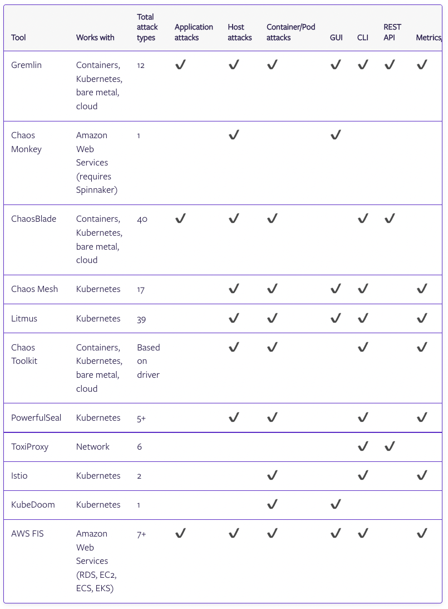

# Chaos Engineering tools comparison

from: https://www.gremlin.com/community/tutorials/chaos-engineering-tools-comparison/

- 이 아티클에서는 가장 인기있는 오픈소스와 상업용 Chaos Engineering 도구에 대해서 살펴 볼 것이다. 
- 이것은 다른 도구와 Gremlin을 직접 비교하기 위한 것이 아니라 각 도구의 기능, 사용 편의성, 시스템/플랫폼 지원 및 확장성을 객관적으로 살펴보기 위한 것이다. 

<br/>

- Gremlin 의 우리 팀은 Netflix 및 Amazon과 같은 회사에서 Chaos Engineering을 구현한 수십년 간의 결합된 경험을 가지고 있다. 
- 대규모 시스템에 카오스 엔지니어링을 적용하는 방법과 엔지니어가 카오스 엔지니어링 솔루션에서 가장 원하는 기능을 이해한다.
- 이 도구가 어떻게 비교되는지 확인할 수 있도록 마지막 표에 제공하고 있다. 

## Chaos Monkey

- Platform: Spinnaker
- Release year: 2012
- Creator: Netflix
- Language: Go
- 경로: https://www.gremlin.com/chaos-monkey?ref=blog
  
<br/>

- Chaos Monkey 없이는 Chaos Engineering 도구 목록이 완성되지 않는다. 
- 이것은 최초의 오픈 소스 Chaos Engineering 도구 중 하나였으며, 틀림없이 대기업 외부에서 Chaos Engineering의 채택을 시작했다. 
- 이를 기반으로 Netflix 는 Simian Army라고 하는 전체 실패 주입 도구 제품군을 구축했지만 이러한 도구 중 상당수는 이후 사용이 중단 되거나 Swabbie와 같은 도구에 적용되었다. 

<br/>

- Chaos Monkey는 의도적으로 예측할 수 없다. 
- 가상 머신 인스턴스 종료하는 공격 유형만 있다. 
- 실행을 위한 일반적인 시간 프레임을 설정하면 그 시간 동안 임의의 인스턴스가 종료된다. 

- 이는 예측할 수 없는 생산 사고를 복제하는 데 도움이 되기 위한 것이지만 대응할 준비가 되어 있지 않으면 득보다 실이 더 많을 수 있다. 
- 다행이도 Chaos Monkey 가 실행되기 전에 중단을 확인하도록 구성할 수 있지만 여기에는 사용자 지정 Go 코드 작성이 포함된다. 

### Should I use Chaos Monkey?

- Chaos Monkey 는 역사적으로 중요하지만 제한된 수의 공격, 긴 배포 프로세스, Spinnaker 요구 사항 및 장애 주입에 대한 무작위 접근 방식으로 인해 다른 도구 보다 실용적이지 않다. 
- Pros:
  - 광범위한 개발 이력을 가진 잘 알려진 도구이다.
  - 언제든지 재난에 대비하는 마인드를 만든다. 
- Cons:
  - Spinnaker와 MySQL이 필요하다. 
  - 오직 단일 타입의 실험만 가능 (셧다운)
  - 폭발 반경 및 실행에 대한 제한된 제어, 공격은 기본적으로 무작위이다. 
  - 리커버리 혹은 롤백 메커니즘이 없다.  다른 메커니즘을 사용하려면 고유한 코드를 작성해야 한다. 

## ChaosBlade

- Platforms: Docker, Kubernetes, bare-metal, cloud platforms
- Release year: 2019
- Creator: Alibaba
- Language: Go

<br/>

- ChaosBlade는 알리바바에서 장애 테스트를 위한 최근 10년 정도된 도구이다. 
- 이는 Kubernetes, cloud platforms 그리고 베어메탈등과 같은 넓은 범위를 제공한다. 
- 패킷로스, 프로세스 킬, 리소스 소비 등과 같은 다양한 공격을 제공한다. 
- 그리고 Java, C++, Node.js 등과 같은 어플리케이션 레벨의 장애를 지원한다. 이를 통해 잘못된 코드 인젝션, 코드 실행 딜레이 그리고 메모리 값 변경등을 수행할 수 있다. 

<br/>

- ChaosBlade는 모듈로 설계 되었다. 
- 핵심 도구는 실험 오케스트레이터에 가깝지만 실제 공격은 별도의 구현 프로젝트에서 수행된다. 
- 예를 들어 chaosblade-exec-os 프로젝트는 호스트 공격을 제공하고 chaosblade-exec-cplus 프로젝트는 C++ 공격을 제공한다.

- 실험을 실행하는 것은 다른 도구에 비해 상당히 간단하다.
- ChaosBlade CLI 사용예는 다음이 포함된다. 
  - blade prepare 를 이용하여 사전 실험 작업(예: Java Virtual Machine 프로세스 또는 C++ 애플리케이션 인스턴스에 연결)을 실행한다. 
  - blade create 를 이용하여 실험을 시작한다. 
  - blade status를 이용하여 실험의 상태와 결과를 조회한다. 
  - blade destroy 를 이용하여 실험을 종료하고, 임팩트를 원래로 돌린다. 

- 예를 들어 우리는 CPU 고갈 실험과 결과를 확인할 것이다. 

```json
bash-4.4# blade c cpu fullload
{"code":200,"success":true,"result":"06519262501a6b95"}
bash-4.4# blade status 06519262501a6b95
{
  "code": 200,
  "success": true,
  "result": {
    "Uid": "06519262501a6b95",
    "Command": "cpu",
    "SubCommand": "fullload",
    "Flag": "--debug false --help false",
    "Status": "Success",
    "Error": "",
    "CreateTime": "2020-11-03T20:34:34.766267Z",
    "UpdateTime": "2020-11-03T20:34:35.8329665Z"
  }
}
bash-4.4# blade d 06519262501a6b95
{"code":200,"success":true,"result":"command: cpu fullload --debug false --help false"}
```

- chaosblade-operator 프로젝트를 사용하면 ChaosBlade 를 Kubernetes 클러스터에 배포하고 CRD(사용자 지정 리소스 정의) 를 사용하여 실험을 관리할 수 있다. 
- 불행하게도 영어 사용자에게는 대부분의 ChaosBlade 문서가 표준 중국어로만 제공된다. 
- 그러나 CLI 에는 영어 지침이 있고, blade --help 를 실행하여 실험을 설계하고 실행하는 방법을 배울 수 있다. 

### Should I use ChaosBlade?

- ChaosBlade 는 다양한 실험 유형과 대상 플랫폼을 지원하는 다목적 도구이다. 
- 그러나 중앙 집중식 보고, 실험 일정, 대상 무작위화 및 상태 확인과 같은 몇 가지 유용한 기능이 부족하다. 
- Chaos Engineering을 처음 접하고 다양한 공격을 실험하고 싶다면 훌륭한 도구이다. 

<br/>

- Pros:
  - 다양한 수의 대상과 실험 타입을 제공한다. 
  - 어플리케이션의 장애주입 Java, C++, Node.js 지원
  - 다양한 방법으로 실험을 관리할 수 있음 CLI 명령어, Kubernetes manifest 그리고 REST API 호출
- Cons:
  - 문서가 표준 중국어로만 제공
  - 스케줄링, 안정성, 리포팅등이 부복하다. 

## Chaos Mesh

- Platform: Kubernetes
- Release year: 2020
- Creator: PingCAP
- Language: Go

<br/>

- Chaos Mesh 는 Kubernetes 리소스로 실험을 배포하고 관리할 수 있는 Kubernetes 기본 도구이다. 
- 또한 CNCF(Cloud Native Computing Foundation) 샌드박스 프로젝트이기도 하다. 

<br/>

- Chaos Mesh 는 리소스 소비, 네트워크 지연, 패킷 손실, 대역폭 제한, 디스크 I/O 지연, 시스템 시간 조작 및 커널 패닉을 포함한 17가지 고유한 공격을 지원한다. 
- 이것은 Kubernetes 도구 이므로 Kubernetes 레이블 및 선택기를 사용하여 폭발 반경을 미세 조정할 수 있다. 

<br/>

- chaos mesh는 Chaos Dashboard 라고 하는 모든 기능을 갖춘 웹 사용자 인터페이스(UI)를 포함한 몇 안되는 오픈소스 도구중 하나이다. 
- 새 실험을 만드는 것 외에도 대시보드를 사용하여 실행 중인 실험을 관리하고 실행 타임라인을 볼 수 있다. 
- Chaos Mesh는 Grafana 와 통합되므로 클러스터의 메트릭과 함께 실행을 확인하여 직접적인 영향을 확인할 수 있다. 

- 실험을 즉시 실행하거나 cron 을 사용하여 예약할 수 있다. 
- Chaos Mesh 에는 스케줄링 메커니즘이 내장되어 있지 않으며 기본적으로 임시 실험은 무기한 실행된다. 
- 실험 기간을 설정하는 유일한 방법은 일정을 잡거나 수동으로 중지하는 것이다. 

<br/>

- 마지막으로 Chaos Mesh는 실험 CI/CD 파이프라인에 통합할 수 있는 GitHub Action을 제공한다. 
- Docker(종류)에서 Kubernetes를 사용하여 임시 Kubernetes 클러스터를 만들고 애플리케이션과 Chaos Mesh를 배포하고 유효성 검사를 위해 지정한 명령을 실행한다. 
- 다른 툴이 CI/CD 통합을 지원할 수 있지만 이미 GitHub에서 코드를 호스팅하고 있다면, 편리한 기능일 것이다.

### Should I use Chaos Mesh?

- Chaos Mesh 는 대시보드 및 구성 구조를 통해 Kubernetes의 Chaos Engineering에 대한 한 가지 접근 방식을 제공한다. 
- 배포 경로를 제공하고 CI/CD 를 통해 자동화된 혼돈 실험을 장려한다. 
- 그러나 가장 큰 한계는 노드 수준 실험이 부족하고 기본 스케줄 기능이 부족하여 임시 실험에 대한 시간 제한이 없다는 것이다. 

- Pros:
  - 언제든지 실험을 일시 중지하고 재개할 수 있는 포괄적인 웹 UI
  - 손쉬운 CI/CD 자동화를 위한 기본 GitHub 작업 통합
- Cons:
  - 노드 수준 공격이 없다. (커널 공격 제외)
  - CRI-O 를 제공하지 않는다. 
  - 임시 실험은 무기한 실행된다. 
  - 기간을 설정하는 유일한 방법은 실험을 예약하거나 수동으로 종료하는 것이다. 
  - 대시보드에 보안 이슈가 있다. 누구든지 접근하여 클러스터 기반의 카오스 엔지니어링을 수행할 수 있다. 

## Litmus

- Platforms: Kubernetes
- Release year: 2018
- Creator: MayaData
- Language: TypeScript

<br/>

- Chaos Mesh와 마찬가지로 Litmus는 CNCF 샌드박스 프로젝트이기도 한 Kubernetes 기반 도구이다. 
- 원래 Kubernetes 용 오픈 소스 스토리지 솔루션인 OpenEBS를 테스트하기 위해 만들어졌다. 
- 컨테이너, 파드, 노드 뿐만 아니라 특정 플랫폼과 도구를 테스트 하기 위한 수많은 실험을 제공한다. 
- 예를 들면 AWS EC2 인스턴스를 종료할 수 있고, Kafka cluster에서 disk fail을 주입하거나, OpenEBS Pod를 죽일 수 있다. 
- 이 실험은 완전하게 문서화 되어 있으며, 하나하나 따라할 수 있다. 
- Litmus 는 또한 중앙화된 리포지토리를 이용하여 실험을 받아 올 수 있으며 ChaosHub 라고 부른다.
- https://hub.litmuschaos.io/

<br/>

- Litmus 에는 Litmus Probes 라는 상태 확인 기능이 포함되어 있어 실험 전, 실험 중, 실험 후에 애플리케이션의 상태를 모니터링할 수 있다. 
- 프로브는 셀 명령을 실행하거나 HTTP 요청을 보내거나 Kubernetes 명령을 실행하여 실험을 실행하기 전에 환경 상태를 확인할 수 있다. 
- 이는 시스템이 불안정한 경우 오류 감지를 자동화하고 실험을 중단하는 데 유용하다. 

<br/>

- Litmus 를 시작하는 것은 대부분의 다른 도구보다 훨씬 어렵다. 
- 기본적으로 Litmus 를 사용하려면 실험하려는 각 애플리케이션 및 네임스페이스에 대한 서비스 계정과 주석을 생성해야한다. (리트머스를 관리자 모드로 실행하여 리소스를 단일 네임스페이스로 통합함으로써 이러한 관리 오버헤드의 일부를 줄일 수 있다.)
- 이렇게 하면 보안이 추가되고 우발적인 오류가 발생하기가 더 어려워 지지만 실험이 복잡해진다.
- 리트머스 실험 실행에는 다음이 포함된다. 
  - 실험이 포함된 Chaos Chart를 배포한다. 이것은 chaosexperiment 리소스를 생성한다. 
  - chaosServiceAccount 를 생성하여 어플리케이션의 네임스페이스에서 Litmus를 실행할 수 있도록 허용한다. 
  - Litmus가 실험을 실행하도록 어플리케이션에 어노테이션을 단다.
  - ChaosEngine 리소스를 생성하여 어플리케이션이 실험에 연동되도록 한다. 여기서 실험 파라미터를 설정한다. 
    - 만약 실험을 정지/재시작 하기를 원한다면 ChaosEngine 리소스를 패치할 필요가 있다. 
  - 실험이 실험 상태를 알려주는 Chaos 결과를 생성할 때 까지 기다린다. 
  - 테스트가 끝나면 이러한 모든 리소스를 정리한다. 

<br/>

- 또는 웹 기반 UI인 Litmus Portal을 이용하여 실험을 관리할 수 있다. 
- Litmus Portal은 Workflow를 이용하며, 동일한 실험에서 여러 공격을 실행하는 워크플로를 사용한다. 
- 워크플로를 생성, 실행 및 예약하는 것 이외에도 Litmus Portal을 사용하면 성공적인 결과의 중요성을 나타내는 가중치를 각 실험에 할당할 수 있다. 
- 실험이 완료되면 이 가중치가 전체 복원력 점수에 반영된다. 

### Should I use Litmus?

- Litmus 는 많은 유용한 공격 및 모니터링 기능을 갖춘 포괄적인 도구이지만 가파른 학습곡선이 있다. 
- 단순히 실험ㅇ르 실행하는 것은 권한을 설정하고 배포에 주석을 달아야 하는 다단계 프로세스이다. 
- 특히 Litmus Portal을 통해 사용할 때 워크플로가 도움이 되지만 여전히 복잡성이 추가된다. 
- Litmus Portal 자체와 같은 일부 기능이 문서에 나타나지 않고 프로젝트의 GitHub 저장소를 통해서만 사용할 수 있다.

<br/>

- Pros:
  - 웹 UI는 대시보드와 성공적인 워크플로우를 기반으로 복원력 점수를 제공한다. 
  - 대규모 실험을 ChaosHub를 통해 수행이 가능하다. 
  - Litmus Probes 로 자동화된 시스템 헬스 체크가 가능하다. 
- Cons:
  - 실험을 실행하기 위한 길고 복잡한 프로세스
  - 실험을 정리할 때 많은 관리 오버헤드가 발생한다. 
  - 웹 UI(Litmus Portal)에 대한 기능이 제한되고 설명서가 누락되어 있다. 
  - 권한은 실험별로 할당되므로 액세스를 추적하고 관리하기가 어렵다. 

## Chaos Toolkit

- Platforms: Docker, Kubernetes, bare-metal, cloud platforms
- Release year: 2018
- Creator: ChaosIQ
- Language: Python

<br/>

- Chaos Toolkit 은 Ansible과 같은 인프라 자동화 도구를 사용해본 사람이라면 누구나 친숙하다. 
- 사전 정의된 실험에서 선택하는 대신 Chaos Toolkit 을 사용하여 직접 정의할 수 있다. 

<br/>

- 각 실험은 actions과 probes로 구성되어 있다. 
- Actions는 대상 시스템에서 커맨드를 실행한다. 
- Probes는 실험과 기대값이 동일한지 검사한다. 
- 예를 들어 웹 서버에서 CPU를 소모하기 위해 stress-ng 를 호출하는 Action을 만든 다음 Probe를 사용하여 웹 사이트가 특정 시간 내에 응답하는지 확인할 수 있다. 
- Chaos Toolkit은 또한 서로다른 서비스와 플랫폼과 상호작용하기 위해서 드라이버를 제공한다. 
- 예를 들어 AWS 드라이버를 이용하여 AWS에서 실험할 수 있다. 혹은 Toxiproxy와 Istio 와 같은 다른 툴을 이용할 수 있다. 
- Chaos Toolkit 은 또한 환경에서 자동으로 서비스를 찾아내고 맞춤형 실험을 추천할 수 있다. 

<br/>

- 실험은 JSON 파일에 정의되며 세 단계로 나뉜다. 
  - steady-state-hypothesis (정상 상태 가설)
    - 시스템의 현재 상태를 측정하여 시스템이 실험에 충분히 건강한지 확인
  - method
    - 메소드는 실험을 시작할때 사용할 스텝을 포함한다. 
  - rollback
    - rollback은 시스템이 안정적인 상태로 돌린다. 

- 각 단계에는 여러 Actions 및 Probes가 포함될 수 있다. 예를 들어 실패한 Kubernetes Pod를 다시 시작하는 기능을 테스트하려는 경우 다음 실험을 생성할 수 있다.
  - steady-state-sypothesis (정상 상태 가설)
    - Probes 를 사용하여 Pod가 실행 중이고 대상 서비스가 응답하는지 확인한다. 
  - method
    - Pod를 죽이고 15초간 대기하고, 검증을 수행한다. 
  - rollback
    - 실패한 서비스를 복원하기 위해 애플리케이션 매니페스트를 다시 적용한다. 


- Chaos Toolkit은 다양한 플랫폼을 지원하지만 전적으로 CLI 를 통해 실행된다. 
- 따라서 AWS 와 같은 클라우드 플랫폼이나 Kubernetes와 같은 오케스트레이션 플랫폼을 사용하지 않는 한 여러 시스템에서 실험을 실행하기 어렵다.

### Should I use Chaos Toolkit?

- 혼돈 실험을 설계할 수 있게 해주는 유연한 도구는 거의 없다. 
- Chaos Toolkit 을 사용하려면 대상 시스템에서 실행되는 명령에 이르기까지 실험이 작동하는 방식을 완전히 제어할 수 있다. 
- 그러나 이 DIY 접근방식 때문에 Chaos Toolkit은 바로 사용할 수 있는 Chaos Engineering 솔루션보다 구축해야하는 프레임워크에 가깝다. 

<br/>

- Pros:
  - 시스템을 정상 상태로 되돌리기 위한 기본 롤백 메커니즘을 포함하여 실험을 완전히 제어한다. 
  - 서비스를 자동 검색하고 실험을 추천하는 기능
  - 내장된 로깅 및 보고 기능
- Cons:
  - 내장된 기본 스케줄링 기능 없음
  - 특정 드라이버를 사용하지 않고 여러 시스템에서 공격을 실행하는 쉬운 방법은 없다. 
  - 실험을 만드는 데 더 많은 실습과 기술적 노력이 필요하다. 
  - 실험의 제한된 이식성 

## PowerfulSeal

- Platforms: Kubernetes
- Release year: 2017
- Creator: Bloomberg
- Language: Python

<br/>

- PowerfulSeal 은 CLI 툴이며 쿠버네티스 클러스터에서 실험을 수행하는데 사용된다. 
- 가장 유니크한 기능은 3가지 다른 실행 모드를 가진다. 
  - Autonomous(자율모드) 로 수행되는 실험을 실행한다. 이것은 다른 도구와 가장 유사하다. 
  - 대화형 모들를 사용하면 명령줄을 통해 수동으로 실패를 주입할 수 있다. 
  - 레이블 모드를 사용하면 대상으로 지정하거나 무시할 특정 Kubernetes Pod에 태그를 지정한다. 이것은 폭발 반경을 미세 조정하고 중요한 포드를 실험에 면역되도록 만드는데 유용하다. 

- 실험(정책이라고함)은 YAML 파일에 정의되며 실험 매개변수, 수행된 단계 및 서비스 상태를 확인하기 위한 HTTP 프로브를 설정한다. 
- 기본적으로 PowerfulSeal 은 정책을 지속적으로 실행하고 실행 횟수를 지정하지 않는 한 오류 발생 시에만 중지한다. 
- Prometheus 또는 Datadog 으로 내보낼 수 있는 자체 내부 메트릭을 추적한다. 여기에는 중단된 Pod수 중지된 노드 및 실패한 실행이 포함된다. 

<br/>

- 대화식 모드에서 PowerfulSeal 은 기본적으로 kuectl 을 둘러싼 래퍼가 된다. 
- 클러스터의 리소스를 쿼리하거나 Pod를 종료하거나 노드를 제거할 수 있다. 
- 자율 모드만큼 기능이 풍부하지 않으며 실험을 계획하거나 소규모의 일회성 실험을 실행하는 데 가장 적합하다. 
- 마지막으로 레이블 모드를 사용하면 파드가 종료될 수 있는 시기 및 종료 확율과 같은 파드별 매개변수를 설정할 수 있다.
- 이는 중요한 Pod가 실수로 종료되는 것을 방지하는 데 유용하다. 

### Should I use PowerfulSeal?

- PowerfulSeal 은 다른 도구가 아직 할 수 없는 기능을 많이 제공하지 않는다. 
- 구문은 이해하기 쉽고 다양한 모드는 실험을 더 잘 제어할 수 있지만 공격 유형의 수가 제한적이고 다른 차별화 기능이 부족하다. 

<br/>

- Pros:
  - 실험과 폭발 반경을 세밀하게 제어할 수 있다. 
- Cons:
  - 제한된 수의 공격 타입
  - 제한적이며 일부 영역에서는 문서가 불완전

## Toxiproxy

- Platforms: Any
- Release year: 2014
- Creator: Shopify
- Language: Go

<br/>

- Toxiproxy는 대기 시간, 연결 손실, 대역폭 제한 및 패킷 조작과 같은 조건을 생성할 수 있는 네트워크 장애 주입 도구이다. 
- 이름에서 알수 있듯이 두 서비스 사이에 있는 프록시 역할을 하며 트래픽에 직접 장애를 주입할 수 있다. 

<br/>

- Toxiproxy는 2가지 컴포넌트가 있다. Go 로 작성된 프록시 서버와 프록시와 통신하는 클라이언트 2가지이다.
- Toxiproxy 서버를 구성할 때 애플리케이션 간의 경로를 정의한 다음 해당 경로를 따라 트래픽의 동작을 변경하기 위해 카오스 실험(독성이라고 함)을 생성한다.
- 명령줄 클라이언트 또는 REST API 를 사용하여 실험을 관리할 수 있다. 

### Should I use Toxiproxy?

- Toxiproxy의 주요 과제는 설계에 있다. 
- 왜냐하면 프록시 서비스이기 때문에 이를 통해 네트워크 트래픽을 라우팅하도록 애플리케이션을 재구성 해야한다. 
- 이는 배포에 복잡성을 추가할 뿐만 아니라 단일 서버가 여러 애플리케이션을 처리하는 경우 단일 실패 지점을 생성한다. 
- 이러한 이유로 유지 관리조자도 프로덕션 환경에서 사용하지 말 것을 권장한다. 

<br/>

- Toxiproxy 는 또한 실험 예약, 실험 중지 및 모니터링과 같은 많은 제어 기능이 부족하다. 
- 독성은 삭제할 때까지 계속 실행되며 포트 충돌로 인해 간헐적으로 연결 오류가 발생할 위험이 있다. 
- 개발 중에는 테스트 시간 초과 및 재시도에는 적합하지만 프로덕션 환경에서는 그렇지 않다. 

<br/>

- Pros:
  - 직관적인 setup과 config
  - 포괄적인 네트워크 공격 세트 포함
- Cons:
  - 네트워크 트래픽에 대한 단일 실패 지점을 만든다. 
  - 프로덕션 시스템을 검증하는 데 유용하지 않거나 권장되지 않는다. 
  - 보안 통제가 없다. Toxiproxy에 대한 액세스 권한이 있는 사람이 모든 서비스에서 실험을 실행할 수 있다. 
  - 느린 개발 속도, 마지막 최근 릴리즈가 2019년 1월이다. 그리고 몇몇 클라이언트들은 2년 이상 업데이트 되지 않았다. 

## Istio

- Platform: Kubernetes
- Release year: 2017
- Creators: Google, IBM, and Lyft
- Language: Go

<br/>

- Istio 는 Kubernetes 서비스 메시로 가장 잘 알려져 있지만 기본적으로 결함 주입을 지원한다는 사실을 아는 사람은 많지 않다. 
- 트래픽 관리 기능의 일부로 Istio 는 모든 가상 서비스간의 네트워크 트래픽에 대기 시간 또는 HTTP 오류를 주입할 수 있다. 
- 실험은 Kubernetes 매니페스트로 정의되어 실험을 쉽게 실행하고 중지할 수 있다. 
- 가상 서비스 및 라우팅 규칙과 같은 기존 Istio 기능을 사용하여 대상을 선택하고 트래픽의 비율에만 영향을 미치도록 공격의 규모를 조정할 수 있다. 
- 상태 확인 및 Envoy 통계를 사용하여 시스템에 미치는 영향을 모니터링할 수도 있다. 

<br/>

- 이것은 Istio의 Chaos Engineering 기능의 범위에 관한 것이다. 
- 실험을 예약하거나 호스트에서 실행하거나 광범위하게 사용자 지정하거나 Istio 외부에서 사용할 수 없다. 
- 추가 카오스 엔지니어링 도구나 기능을 추가하지 않고 이러한 실험을 수행하기 위해 네트워크에서 Istio 의 위치를 어느 정도 활용하고 있다. 

### Should I use Istio?

- 이미 Istio 를 사용하고 있다면 다른 도구를 배포하거나 배울 필요 없이 클러스터에서 혼돈 실험을 쉽게 실행할 수 있는 방법이 있다. 
- 그렇지 않으면 이 기능만을 위해 Istio 를 배포할 가치가 없다. 

<br/>

- Pros:
  - Istio 에 기본내장되어 있다. 추가 설정이 필요하지 않다. 
  - 실험들은 단순 쿠버네티스의 manifest이다. 
- Cons:
  - 오직 2개 실험 타입이 있다. 
  - 이미 Istio를 사용하고 있지 않다면 이 기능만을 추가하는 것은 무리일 수 있다. 

## Kubedoom

- Platforms: Kubernetes
- Release year: 2019
- Creator: David Zuber (storax)
- Language: C++

<br/>

- 카오스 엔지니어링이 재미없었던 것처럼 이제 Doom 을 하면서 플레이할 수 있다.
- Kubedoom은 고전 게임의 포크이지만 반전이 있다. 
- 각 적은 클러스터의 다른 Pod를 나타내며 적을 죽이면 해당 Pod가 죽는다. 
- 더 큰 혼란을 위해서(그리고 충분히 큰 클러스터를 사용하여) 각 적을 고유한 네임스페이스로 만들 수 있다. 

### Should I use Kubedoom?

- 사용해도 된다. 만약 안전하게 복구할 수 있는 방법을 알고 있다면 말이다. 
- 클러스터에 대한 '신 모드' 치트 코드는 없다. 

<br/>

- Pros:
  - 공식적으로 직책 "Doom Slayer"를 추가할 수 있다. 
- Cons:
  - Doom을 플레이하는 것이 왜 당신의 일의 일부인지 매니저에게 설명해야한다. 

## AWS Fault Injection Simulator

- 동작: Amazon Relational Database Service (RDS), Elastic Compute Cloud (EC2), Elastic Container Service (ECS), 그리고 Elastic Kubernetes Service (EKS)
- Release year: 2021
- Creator: Amazon Web Services

<br/>

- 2020년 말 AWS re:Invent에서 발표된 AWS FIS(Fault Injection Simulator) 는 AWS의 가장 인기있는 서비스 중 일부에 장애를 도입하기 위한 관리형 서비스이다. 
- FIS는 EC2 인스턴스 재부팅, ECS 클러스터 드레이닝 또는 RDS 인스턴스 재부팅을 포함한 7가지 기본 공격 유형을 지원한다. 
- FIS는 또한 SSM을 호출하여 stress-ng 명령을 사용하여 리소스를 소비하거나 tc명령을 사용하여 네트워크 트래픽을 관리하는 것과 같은 사용자 지정 명령을 실행할 수 있다. 
- 다른 도구와 달리 FIS는 AWS 제어 평면을 통해 AWS 서비스에 장애를 주입할 수 있다. 
- 이를 통해 관리형 데이터베이스 클러스터 장애 조치 또는 API 요청 조절과 같은 시나리오가 가능하다. 

<br/>

- 각 실험은 6개 컴포넌트를 가진다. 
  - A description: 설명
  - An IAM role: 실행 롤
  - A set of actions to perform (예: failure injections)
  - Targets to run on 
  - Stop condition(optional)
  - Custom tags

- 작업은 순차적으로 또는 병렬로 수행할 수 있으며 원하는 수의 리소스를 대상으로 할 수 있다. 
- SSM을 사용하는 경우 각 대상에서 실행할 명령이 포함된 SSM 문서도 작성해야한다. 
- 중지 조건은 CloudWatch 경보를 사용하여 정의되므로 공격을 자동으로 중지할 수 있다. 

### Should I use AWS FIS?

- FIS는 제한된 수의 AWS 서비스만 지원하고 제한된 수의 공격이 있기 때문에 FIS 사용 여부는 환경에서 사용하는 서비스에 따라 다르다. 
- FIS에서 공격을 실행하는 프로세스는 어려울 수 있다. 
- FIS 작업을 실행하고, ID별로 특정 AWS 리소스를 대상으로 지정하고, SSM을 사용하는 경우 SSM 문서를 구성할 수 있도록 IAM 역할을 생성해야한다. 
- 그리고 공격 비용은 작업당 분당 $0.10에 불과하지만 수명이 긴 실험을 실행하거나 여러 작업을 수행하는 실험이 빠르게 추가될 수 있으며 SSM 사용에 대한 추가 비용이 있다. 

<br/>

- Pros:
  - agent 설치가 필요 없다.
  - AWS의 가장 인기 있는 서비스 중 일부에 대해 API수준 오류를 허용한다.
  - 혼돈 실험을 병렬로 실행한다. 
  - 통합 결제를 위해 AWS 콘솔을 통해 사용할 수 있다. 
- Cons:
  - 4개의 AWS 서비스에서만 작동한다. 
  - 각 서비스에 대한 제한된 실패 모드
  - 실험을 만드는 데 더 많은 실습과 기술적 노력이 필요하다. 
  - 모든 실험 유형을 중지하거나 롤백할 수 있는 것은 아니다. 

## Which tool is right for me?

- 궁극적으로 모든 카오스 엔지니어링 도구의 목표는 더 높은 안정성을 달성하도록 돕는 것이다. 
- 문제는 그 목표를 더 빠르고 쉽게 달성하는 데 어떤 도구가 도움이 되는가?
- 물론 이 질문은 기술 스택, 엔지니어링 팀의 경험과 전문성, 각 도구를 테스트하고 평가하는 데 얼마나 많은 시간을 할애할 수 있는지에 따라 다르다. 
- 이러한 도구가 서로 어떻게 쌓이는지 보여주기 위해 비교 매트릭스를 살펴보자. 


